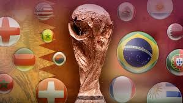
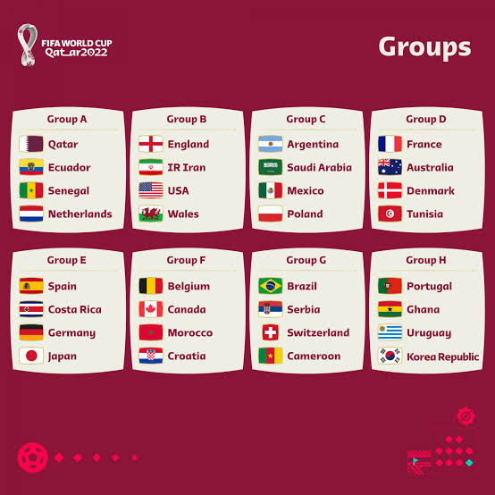
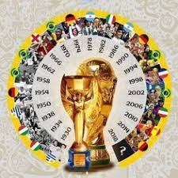
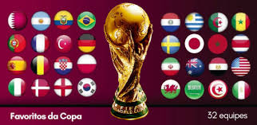
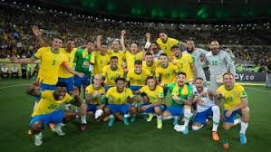
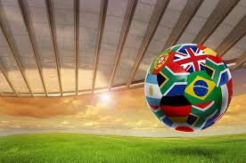

# Copa do mundo

---
 
Mundial de Futebol0

---
 

mais conhecido no Brasil por Copa do Mundo e também conhecida em Portugal como Campeonato do Mundo de Futebol, Campeonato Mundial de Futebol, Campeonato Mundial FIFA, ou simplesmente Mundial,[1][2] é uma competição internacional de futebol que ocorre a cada quatro anos, com exceção de 1942 e 1946, quando não foi realizada por conta da Segunda Guerra Mundial. Essa competição, que foi criada em 1928 na França, sob a liderança do presidente Jules Rimet, está aberta a todas as federações reconhecidas pela FIFA (Federação Internacional de Futebol Associado, em francês: Fédération International de Football Association). O antigo nome da taça faz referência a Jules Rimet. A primeira edição ocorreu em 1930 no Uruguai, cuja seleção saiu vencedora.  
 

 

Copa do Mundo FIFA

Dados gerais
Organização
Federação Internacional de Futebol (FIFA)
Edições
21
Local de disputa
País escolhido durante congresso da FIFA
Sistema
Torneio concentrado
Grupos e eliminatória
Dados históricos
Primeiro vencedor	Uruguai (1930)
Último vencedor	França (2018)
Maior vencedor	Brasil (5 títulos) (1958,1962, 1970, 1994 e 2002)
Estatísticas
Total de gol(o)s	2 548
Total de jogos	900
Média	2,83 gols por partida. 

---

Globo.

---
 A TV Globo, que por décadas foi a que mais passou jogos de futebol na televisão brasileira, tem perdido direitos de transmissão de competições nacionais e internacionais. Agora, São 7 canais –entre TV aberta, a cabo, streaming e YouTube– com contratos ativos. Em 2022, a Globo segue com os direitos de transmissão das duas principais competições nacionais: a Copa do Brasil e o Brasileirão. As partidas são divididas com o canal esportivo de TV a cabo do grupo, o SporTV, e com o pay per view Premiere (antigo PFC). Neste ano, este último fechou uma parceria com o streaming Amazon Prime Video para ...

Leia mais no texto original: (https://www.poder360.com.br/midia/com-fim-do-monopolio-da-globo-7-canais-transmitirao-o-futebol-em-2022/)
© 2022 Todos os direitos são reservados ao Poder360, conforme a Lei nº 9.610/98. A publicação, redistribuição, transmissão e reescrita sem autorização prévia são proibidas.
O Poder360 preparou um infográfico para ajudar os fanáticos a se programarem. Saiba onde os principais campeonatos de futebol serão transmitidos em 2022: ...

Leia mais no texto original: (https://www.poder360.com.br/midia/com-fim-do-monopolio-da-globo-7-canais-transmitirao-o-futebol-em-2022/)
© 2022 Todos os direitos são reservados ao Poder360, conforme a Lei nº 9.610/98. A publicação, redistribuição, transmissão e reescrita sem autorização prévia são proibidas.
 
Se a Copa do Mundo chegou, os estaduais saíram. Não há comparação entre o nível técnico e a audiência dos torneios, mas os regionais se prolongam por 3 meses, enquanto o mundial tem menos de 30 dias. O Campeonato Pernambucano será o único estadual ainda com transmissão da Globo em 2022. A casa dos tradicionais Paulistão e Cariocão agora passa a ser a TV Record, que já passou alguns jogos do campeonato fluminense em TV aberta em 2021. O acordo do Campeonato Paulista é mais abrangente. Além da emissora de Edir Macedo, as partidas de São Paulo, Santos, Corinthians e Palmeiras também serão exibi...

Leia mais no texto original: (https://www.poder360.com.br/midia/com-fim-do-monopolio-da-globo-7-canais-transmitirao-o-futebol-em-2022/)
© 2022 Todos os direitos são reservados ao Poder360, conforme a Lei nº 9.610/98. A publicação, redistribuição, transmissão e reescrita sem autorização prévia são proibidas. 

---

               Algumas imagens da Copa

---
  

 

 

 

         Fontes : Globo Esporte / wikipedia
